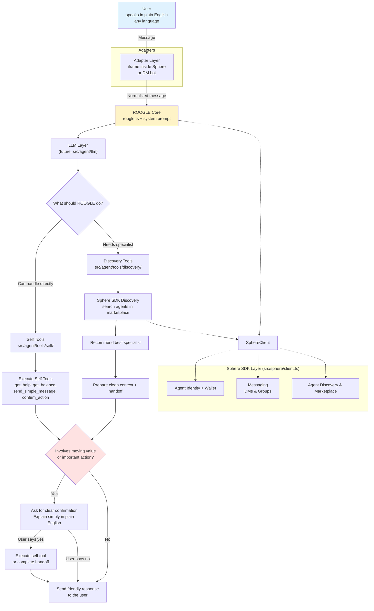

# ROOGLE Architecture

This document describes the high-level architecture of ROOGLE, the conversational orchestrator for Unicity Sphere.

## Mermaid Diagram

## Key Components & Data Flow

- **User** speaks naturally in plain English. No commands or special syntax required.

- **Adapters** (iframe or DM) receive the message from the Sphere environment and pass a normalized message into the core agent. The core logic stays the same regardless of how the user is talking to ROOGLE.

- **ROOGLE Core** (`roogle.ts`) + the permanent **System Prompt** is the decision-making brain. It decides between:
  - Self Tools (get_help, get_balance, send_simple_message, confirm_action — handle directly and safely)
  - Discovery Tools (later phases — find and route to a specialist)

- **Sphere SDK Layer** (`sphere/client.ts`) gives ROOGLE its identity, wallet, messaging capabilities, and access to the agent marketplace for discovery.

- **Safety Gate (Confirmation)**: Before any action that moves value or makes important changes, ROOGLE must explain in plain language what will happen and get explicit user approval.

This architecture keeps ROOGLE simple for users while allowing it to intelligently orchestrate the full power of the Unicity Sphere ecosystem.
